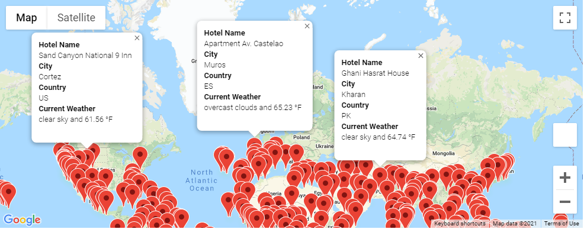
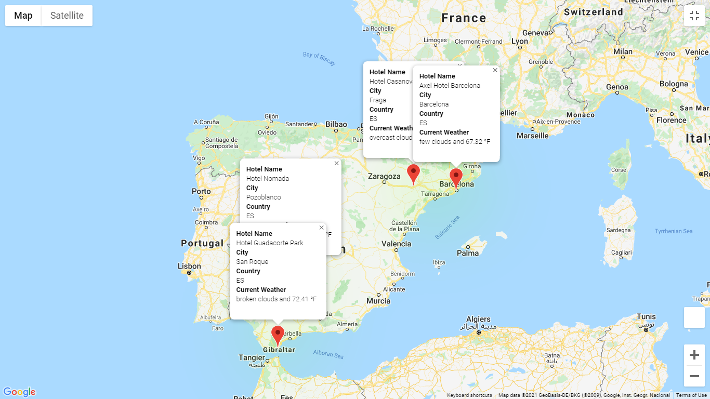

# world-weather-analysis

## Project Overview
The purpose of this analysis to help a top travel-technology company *PlanMyTrip* help collect and present data for customers via a search page. This page will be used by customers, upon which they'll filter based on their preferred travel criteria, in effort to help them find ideal hotels - anywhere in the world. 

I used *citypy module* in a Jupyter Notebook to find 1500 random latitudes and longitudes. Then, I utilized my code to perform requests on the OpenWeatherMap API to retrieve JSON weather data from these cities. Upon the completion of my code, the end-user is now able to apply their own filters for their ideal weather conditions. Using this criteria, my code produces a global map with hotels that exist in cities with these preferred criteria. Hence, the customer can find a hotel in a city where they want to vacation.

## Resources
- Data Sources: WeatherPy_vacation.csv, citipy module
- Software: Python 3.8.8, Jupyter Notebook : 6.3.0, Visual Studio Code, 1.60.2

## Results
I produced various maps which allow users information for hotels to book for their ideal vacations. There are markers to identify each map, and each marker holds the following information: hotel name, city name, country code, current weather description, and the max temperature recorded on the present day from which the data is being requested.

Here is a map with available hotels for a customer's specific request.

I even included an option for a user to plot out a full-circle trip with up to three stops along the way. These stops would also be included on the map, with markers identifying local hotels to stay in and information pertaining to the weather for the cities where these hotels reside in. Here's an example:

## Summary
With this code, PlanMyTrip allows customers to apply filters in terms of ideal locations where they'd like to vacation. They can find hotels for cities where they'd like to reside in - anywhere in the world!